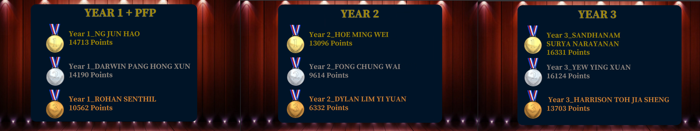

# NYP InfoSec CTF May 2022
Writeups for the challenges I solved during NYP InfoSec CTF held on May 2022.

## Categories
* [Camp CyberCure](Camp-CyberCure)   
* [Programming](Programming)   
* [Web](Web)   
* [Reverse](Reverse)   
* [Pwn](Pwn)   
* [OSINT](OSINT)   
* [Miscellaneous](Miscellaneous)   
* [Forensics](Forensics)   
* [Cryptography](Cryptography)   
* [Networking](Networking)   
 
## Results

* Placed 3rd in the Year 1 Category
